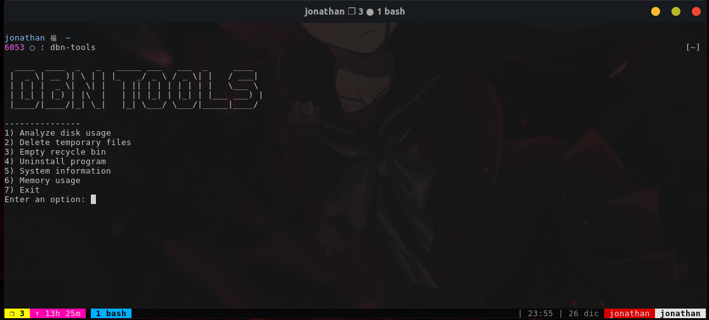

# 💾 DBN-TOOLS

## 💻 With dbn-tools, you can:

- 🔍 Analyze disk usage and see which files and directories are taking up the most space.
- 🗑️ Delete temporary files and free up space on your hard drive.
- 🗑️ Empty the recycle bin to permanently delete files.
- 🧹 Uninstall programs you no longer need.
- 🧰 Get detailed information about your CPU and system.
- 💾 Check the usage of your system's RAM and swap memory.
- 🕰️ Check the system uptime.
- 🔒 Check open ports.
- 🔍 Search for a specific file.



## 💾 Compatibility

- Ubuntu 22.04 ✅
- Debian 11 ✅
- Arch ✅

## 🏳️ Flags

- `--help`: 📜 Display a help message with a list of all available options.
- `--esp`: 🇪🇸 Enable Spanish translation.

## 📁 Folder structure

```
📦dbn-tools
 ┣ 📂DEBIAN
 ┃ ┣ 📜control
 ┣ 📂usr
 ┃ ┗ 📂bin
 ┃ ┃ ┣ 📂constants
 ┃ ┃ ┃ ┣ 📜ascii.sh
 ┃ ┃ ┣ 📂functions
 ┃ ┃ ┃ ┣ 📜delete-temp.sh
 ┃ ┃ ┗ 📜dbn-tools.sh
 ┣ 📂utils
 ┃ ┣ 📜build_new_version.sh
 ┣ 📜CONTRIBUTE.md
 ┣ 📜INSTALL.md
 ┣ 📜LICENSE
 ┣ 📜README.md
 ┗ 📜readme.png
```

## 📁 Dependencies

- Bash
- Git
- Debtap (Arch)

## 📁 Install

You can see how to install it in the following file [INSTALL](./INSTALL.md).

## 📝 License

This project is under the MIT license. See the [LICENSE](./LICENSE) for more information.

## 🤝 Contribute

For more information, check the [CONTRIBUTE](./CONTRIBUTE.md) file

## ✨ Contributors

Thanks goes to these wonderful people ([emoji key](https://allcontributors.org/docs/en/emoji-key)):

<!-- ALL-CONTRIBUTORS-LIST:START - Do not remove or modify this section -->
<!-- prettier-ignore-start -->
<!-- markdownlint-disable -->
<table>
  <tr>
    <td align="center"><a href="https://jonathan.com.ar/es"><br /><sub><b>Jonathan Dyallo</b></sub></a><br /><a href="#!" title="Code">💻</a> <a href="#!" title="Tests">⚠️</a> <a href="#!" title="Documentation">📖</a> <a href="#maintenance-jd-apprentice" title="Maintenance">🚧</a></td>
  </tr>
</table>

<!-- markdownlint-restore -->
<!-- prettier-ignore-end -->

<!-- ALL-CONTRIBUTORS-LIST:END -->

This project follows the [all-contributors](https://github.com/all-contributors/all-contributors) specification. Contributions of any kind welcome!
